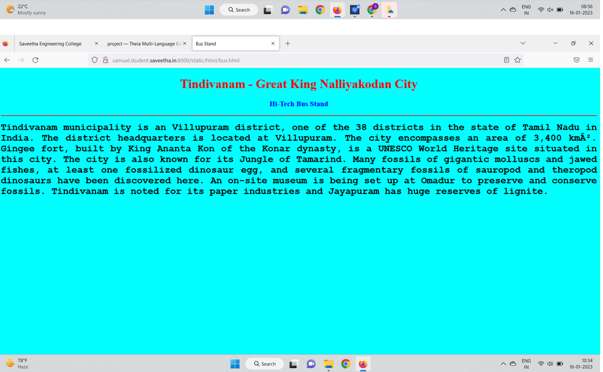
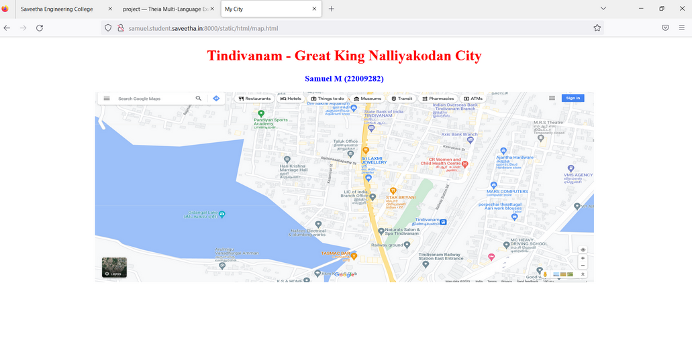
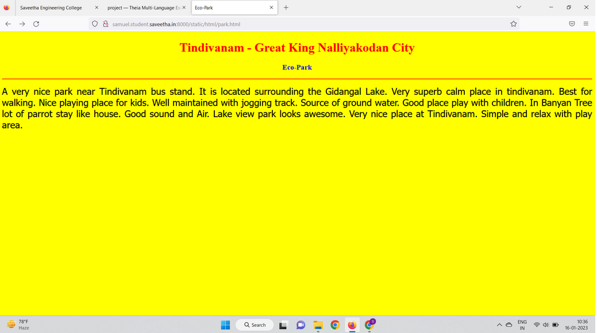
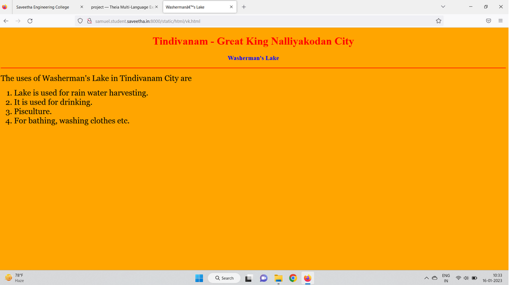
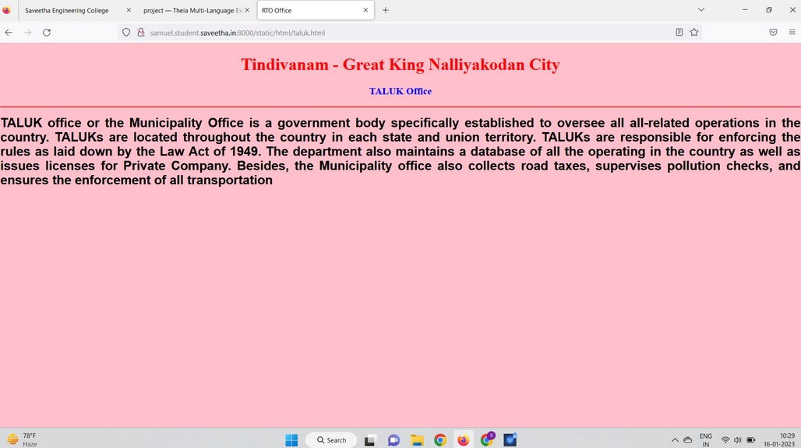
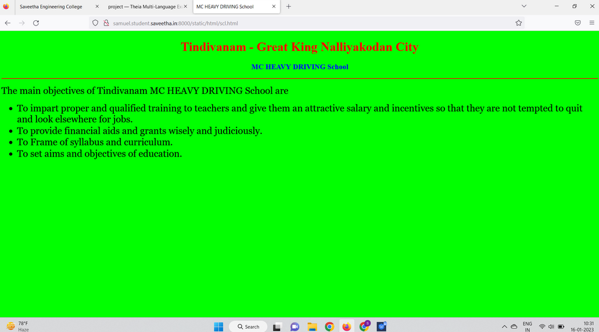

# Places Around Me
## AIM:
To develop a website to display details about the places around my house.

## Design Steps:

### Step 1:
clone the github repository into Theia IDE.
### Step 2:
create a new Django project

## step 3:
Write the needed HTML code.

## step 4:
Run the Django server and execute the HTML files.


## Code:
```
map.html
<!DOCTYPE html>
<html lang="en">
<head>
<title>My City</title>
</head>
<body>
<h1 align="center">
<font color="red"><b>Tindivanam - Great King Nalliyakodan City</b></font>
</h1>
<h3 align="center">
<font color="blue"><b>Samuel M (22009282)</b></font>
</h3>
<center>

<map name="MyCity">
<area shape="circle" coords="190,50,20" href="/static/html/scl.html" title="MC Driving School">
<area shape="rectangle" coords="230,30,260,60" href="/static/html/taluk.html" title="TALUK office">
<area shape="circle" coords="400,350,50" href="/static/html/vk.html" title="Washerman's Lake">
<area shape="circle" coords="400,200,75" href="/static/html/bus.html" title="Hi-Tech Bus Stand">
<area shape="rectangle" coords="490,150,870,320" href="/static/html/park.html" title="Eco-Park">
</map>
</center>
</body>
</html>

bus.html
<!DOCTYPE html>
<html lang="en">
<head>
<title>Bus Stand</title>
</head>
<body bgcolor="cyan">
<h1 align="center">
<font color="red"><b>Tindivanam -  Great King Nalliyakodan City</b></font>
</h1>
<h3 align="center">
<font color="blue"><b>Hi-Tech Bus Stand</b></font>
</h3>
<hr size="3" color="red">
<p align="justify">
<font face="Courier New" size="5">
<b>
Tindivanam municipality is an Villupuram district, one of the 38 districts in the 
state of Tamil Nadu in India. The district headquarters is located at Villupuram. 
The city encompasses an area of 3,400 km². Gingee fort,
built by King Ananta Kon of the Konar dynasty, is a UNESCO World Heritage site 
situated in this city. The city is also known for its Jungle of Tamarind.
 Many fossils of gigantic molluscs and jawed fishes, at least one 
fossilized dinosaur egg, and several fragmentary fossils of sauropod and theropod 
dinosaurs have been discovered here. An on-site museum is being set up at 
Omadur to preserve and conserve fossils. Tindivanam is noted for its paper
 industries and Jayapuram has huge reserves of lignite.
</b>
</font>
</p>
</body>
</html>

park.html
<!DOCTYPE html>
<html lang="en">
<head>
<title>Eco-Park</title>
</head>
<body bgcolor="yellow">
<h1 align="center">
<font color="red"><b>Tindivanam - Great King Nalliyakodan  City</b></font>
</h1>
<h3 align="center">
<font color="blue"><b>Eco-Park</b></font>
</h3>
<hr size="3" color="red">
<p align="justify">
<font face="Tahoma" size="5">
A very nice park near Tindivanam bus stand. It is located surrounding the Gidangal Lake. 
Very superb calm place in tindivanam. Best for walking. Nice playing place for kids.
Well maintained with jogging track. Source of ground water.
Good place play with children.  In Banyan Tree lot of parrot stay like house. 
Good sound and Air. Lake view park looks awesome.
Very nice place at Tindivanam.
Simple and relax with play area.
</font>
</p>
</body>
</html>

taluk.html
<!DOCTYPE html>
<html lang="en">
<head>
<title>RTO Office</title>
</head>
<body bgcolor="pink">
<h1 align="center">
<font color="red"><b>Tindivanam - Great King Nalliyakodan  City</b></font>
</h1>
<h3 align="center">
<font color="blue"><b>TALUK Office</b></font>
</h3>
<hr size="3" color="red">
<p align="justify">
<font face="Arial" size="5">
<b>
TALUK office or the Municipality Office is a government body specifically established to oversee all all-related operations in the country. TALUKs are located throughout the country in each state and union territory. TALUKs are responsible for enforcing the rules as laid down by the Law Act of 1949.
The department also maintains a database of all the  operating in the country as well as issues licenses for Private Company. Besides, the Municipality office also collects road taxes, supervises pollution checks, and ensures the enforcement of all  transportation 
</b>
</font>
</p>
</body>
</html>

scl.html
<!DOCTYPE html>
<html lang="en">
<head>
<title>MC HEAVY DRIVING School</title>
</head>
<body bgcolor="lime">
<h1 align="center">
<font color="red"><b>Tindivanam - Great King Nalliyakodan  City</b></font>
</h1>
<h3 align="center">
<font color="blue"><b>MC HEAVY DRIVING School</b></font>
</h3>
<hr size="3" color="red">
<p align="justify">
<font face="Georgia" size="5">
The main objectives of Tindivanam MC HEAVY DRIVING School are 
<ul>
<li>To impart proper and qualified training to teachers and give them an attractive salary and incentives so that they are not tempted to quit and look elsewhere for jobs.</li>
<li>To provide financial aids and grants wisely and judiciously.</li>
<li>To Frame of syllabus and curriculum.</li>
<li>To set aims and objectives of education.</li>
</ul>
</font>
</p>
</body>
</html>

vk.html
<!DOCTYPE html>
<html lang="en">
<head>
<title>Washerman’s Lake</title>
</head>
<body bgcolor="orange">
<h1 align="center">
<font color="red"><b>Tindivanam - Great King Nalliyakodan  City</b></font>
</h1>
<h3 align="center">
<font color="blue"><b>Washerman's Lake</b></font>
</h3>
<hr size="3" color="red">
<p align="justify">
<font face="Georgia" size="5">
The uses of Washerman's Lake in Tindivanam City are 
<ol type="1">
<li>Lake is used for rain water harvesting.</li>
<li>It is used for drinking.</li>
<li>Pisculture.</li>
<li>For bathing, washing clothes etc.</li>
</ol>
</font>
</p>
</body>
</html>
```

## Output:








## Result:
The program for implementing image map is executed successfully.